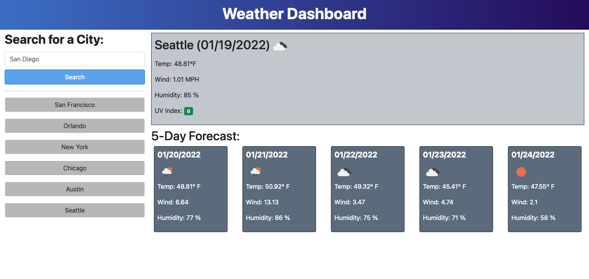

# Weather Dashboard

## Description

The purpose of this project was to create a weather dashboard to quickly see the current weather conditions and the 5-day forecast. Cities whose weather data has been previously searched are saved and can be re-searched with the click of a button.

For this project, I used Bootstrap for styling and the OpenWeather API for the weather data and icons.

## Usage

Type the name of a city within the US into the search box.

## Live Site

[Weather Dashboard](https://brookescodestuff.github.io/weather-dashboard/)

## Screenshot

